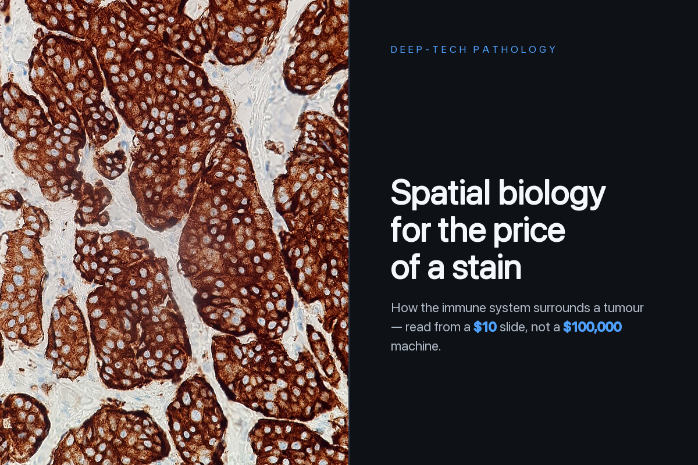
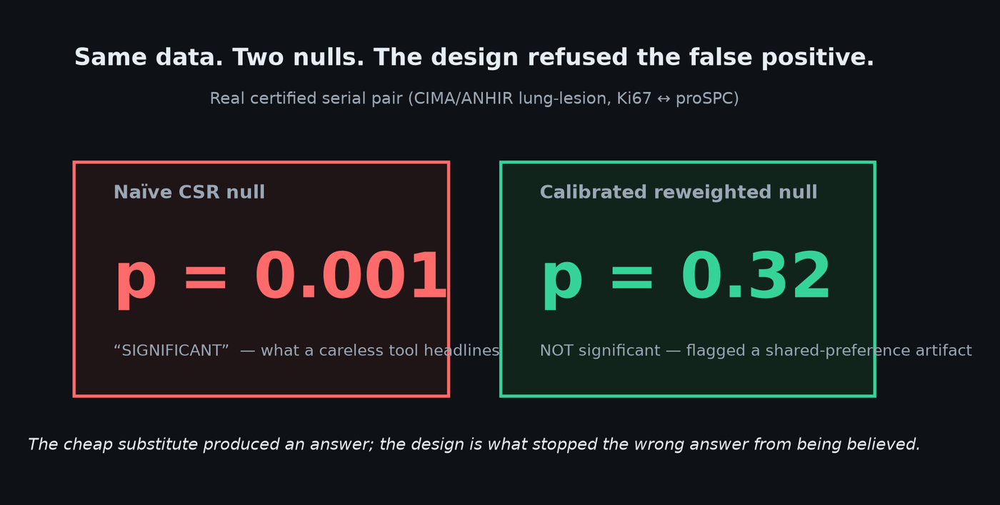
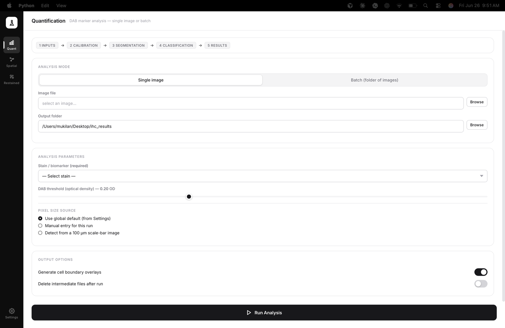
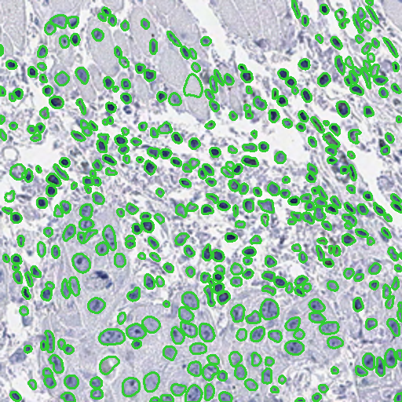
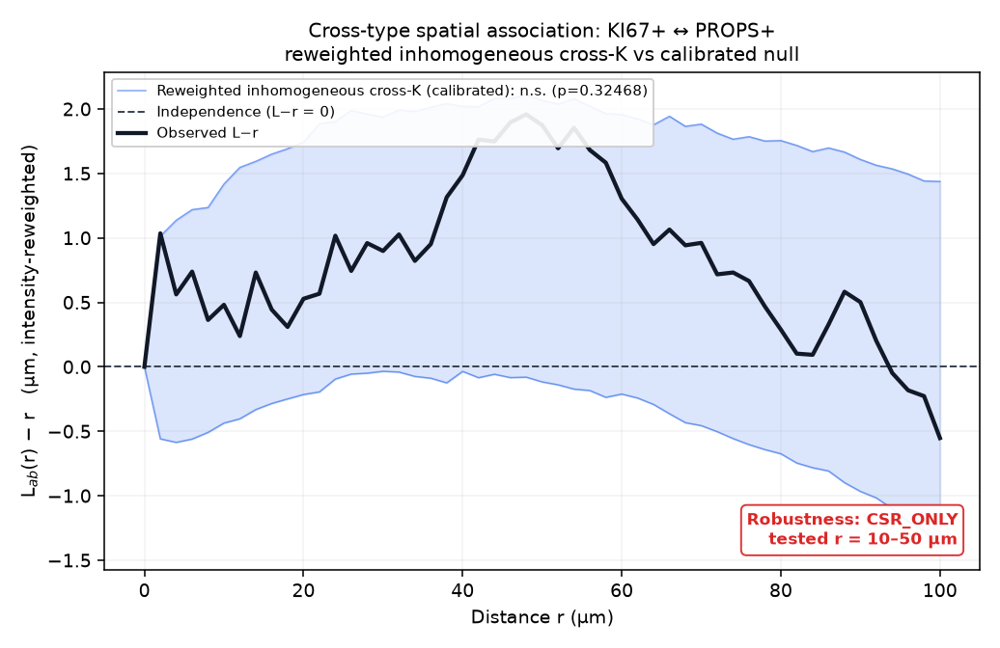
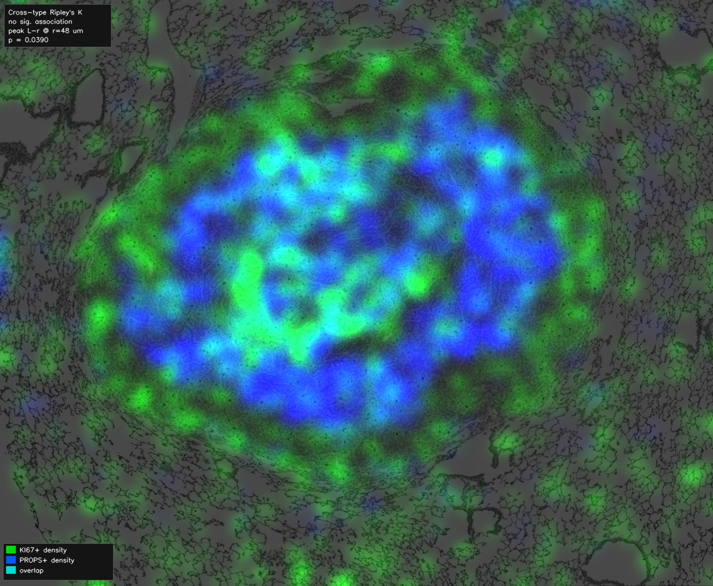
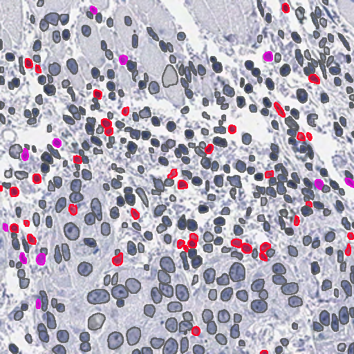
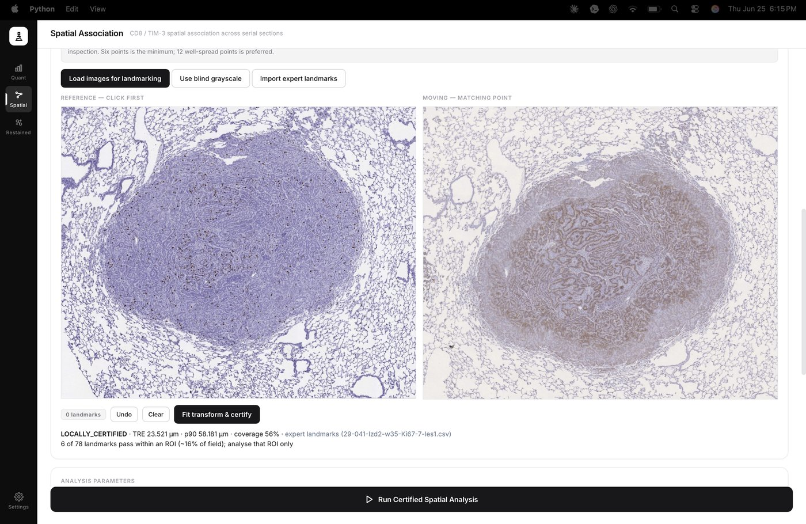
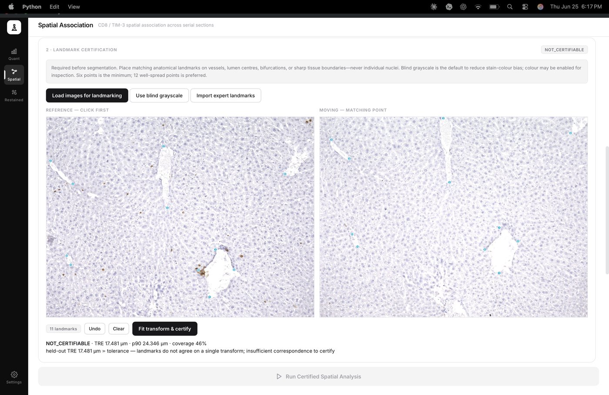

<div align="center">

# IHC Analyzer

### Spatial biology for the price of a stain

**Recover cell-resolution spatial immune biology from ordinary brightfield immunohistochemistry — the ~$10 stain every pathology lab already runs — with an instrument engineered so it cannot report a conclusion it cannot defend.**




</div>

---

## Why this exists

Reading **where** immune cells sit around a tumour — the spatial map that best predicts who
responds to immunotherapy — today requires a **$100,000+ multiplex imaging platform** (CODEX,
Xenium, MIBI, CyCIF). Most hospitals on Earth will never own one. Yet every pathology lab
already runs **brightfield IHC**, a ~100-year-old chromogenic stain costing about **$10**, and
hundreds of millions of those slides already sit in archives.

The gap between those two worlds was never really resolution — it was **trust**. Cheap
substitutes have been tried for years and collapse, because in tissue a *false* pattern looks
exactly like a real one. IHC Analyzer closes that gap by recovering the spatial signal **and**
making the software refuse anything it cannot prove.

<div align="center">



*On a real, certified serial-section pair, the naïve test reported a significant association
(p = 0.001); the calibrated null returned **p = 0.32** and flagged a shared-preference
artifact. Same data — the design is what stopped the wrong answer from being believed.*

</div>

---

## Highlights

- 🧫 **Works on commodity brightfield IHC** — no specialized hardware, no fluorescence.
- 🔒 **Fail-closed by construction** — uncertified registration, uncertified cell
  correspondence, and shared-tissue-preference artifacts are *blocked or flagged, never
  silently reported*.
- 📐 **Calibrated statistics** — an intensity-reweighted cross-type Ripley's K cross-validated
  against R `spatstat` to ~10⁻¹⁴, with a single global DCLF significance test.
- 🧠 **Deterministic core** — QuPath + the InstanSeg deep-learning model for segmentation;
  classical spatial statistics for everything downstream.
- 🖥️ **Desktop + CLI** — a three-tab application and a scriptable pipeline.

---

## Three pipelines, one validated core

### 1 · Quantification
Per-image DAB-positive cell counting from brightfield IHC — the deterministic foundation.

<table>
<tr>
<td width="55%"></td>
<td width="45%"></td>
</tr>
<tr>
<td align="center"><em>The desktop app — staged Inputs → Calibration → Segmentation → Classification → Results.</em></td>
<td align="center"><em>Per-cell nucleus segmentation overlay (positive vs. negative).</em></td>
</tr>
</table>

### 2 · Serial-section spatial association
For two markers on *adjacent* sections: landmark-certified registration, an intensity-reweighted
cross-type Ripley's K against a calibrated null, and one global DCLF test. A **population-level**
statistic — it never asserts single-cell co-expression.

<table>
<tr>
<td width="50%"></td>
<td width="50%"></td>
</tr>
<tr>
<td align="center"><em>The L−r curve against its calibrated null envelope (inside the band ⇒ no association beyond shared tissue preference).</em></td>
<td align="center"><em>Dual-channel density map of the two positive populations in the registered frame.</em></td>
</tr>
</table>

### 3 · Same-section restained co-expression
For stains imaged on the *same* physical section: segment once, reuse the exact cell
coordinates, and call genuine **single-cell** co-expression — gated behind manual
coordinate-correspondence certification.

<div align="center">


<em>Four-class per-cell calls: neither (grey), marker-A only (red), marker-B only (blue), double-positive (magenta).</em>
</div>

---

## Trust is built in, not bolted on

Every automated way to check serial-section alignment was tested and **shown to lie** — a
deliberate 30 µm shift read as ~0.2 µm. So registration is **certified by expert anatomical
landmarks**, graded by held-out error into four verdicts, and statistics run *only* on pairs
that pass.

<table>
<tr>
<td width="50%"></td>
<td width="50%"></td>
</tr>
<tr>
<td align="center"><strong>CERTIFIED / LOCALLY_CERTIFIED</strong> — analysis proceeds.</td>
<td align="center"><strong>NOT_CERTIFIABLE</strong> — analysis is blocked, not guessed.</td>
</tr>
</table>

---

## Validation at a glance

| Test | Result |
|---|---|
| Cross-K vs. R `spatstat` reference | match to **~10⁻¹⁴** |
| Calibrated null — size / power | **3.2%** false positive · **100% / 99.2%** power |
| DCLF under the null | false positive **0.045** |
| Nucleus segmentation vs. real expert masks (268 tiles, 8 patients) | **F1 0.776** |
| Registration certification on real ANHIR/CIMA expert landmarks | only measured ROIs admitted |

> **Honest scope:** the *method* is validated; a finished CD8/TIM-3 biological result is not —
> no serial-section pair has yet passed registration certification on the target cohort, which
> is a data-acquisition limit, not a software one. Full ledger in [`ihc.md`](ihc.md) → Appendix A.

---

## Quickstart

**Requirements:** Python 3.10+ · QuPath 0.7.x with the InstanSeg extension · the InstanSeg
`brightfield_nuclei-0.1.1` model · macOS (targeted desktop environment).

```bash
python -m venv .venv && source .venv/bin/activate
pip install -r requirements.txt
cp .env.example .env
cp config.example.yaml config.yaml      # then edit local paths

python app.py                                              # desktop UI (all three tabs)
python run_pipeline.py --config config.yaml               # quantification
python run_pipeline.py --config config.yaml --mode spatial  # serial-section spatial association
```

---

## Repository structure

```text
app.py                    Desktop entry point (pywebview)
run_pipeline.py           Orchestrator + CLI (quantification / spatial)
spatial.py, spatial_stats.py   Cross-type Ripley's K, calibrated nulls, DCLF
registration.py, serial_registration.py   Image registration + landmark certification
cell_expansion.py         Voronoi-clipped membrane/cytoplasm measurement
restained_coexpression.py Same-section single-cell co-expression
overlay.py, dashboard.py, pixel_size_util.py, file_matcher.py
webui/                    Desktop UI + Python bridge
validation/              Validation harnesses (statistics, registration, segmentation)
assets/                  Figures used in this README
```

---

## Documentation

- **[`paper.md`](paper.md)** — the problem, the first-principles insight, technical foundations,
  validation, and the future.
- **[`ihc.md`](ihc.md)** — full technical reference + consolidated validation ledger (Appendix A)
  + corrections log (Appendix B).
- **[`learn.md`](learn.md)** — the whole project explained with no assumed background in
  pathology, microscopy, or statistics.

**Further resources:** [presentation deck](https://canva.link/agmetzji7s05ify) ·
[supporting materials (Google Drive)](https://drive.google.com/drive/folders/1N3wTEH9Won0i12BUm7qTa2qOzFoo7s2J?usp=share_link)

---

## Credits

Built on **QuPath**, the **InstanSeg** `brightfield_nuclei` model, and the scientific Python
stack (NumPy, SciPy, scikit-image, OpenCV, Shapely, SimpleITK, matplotlib, pywebview).
Cross-validated against **R `spatstat`**. Validated against, and crediting, the **Schürch et al.
2020 colorectal CODEX** dataset, the **ANHIR/CIMA** expert-landmark benchmark, the **HNSCC
mIF/mIHC comparison** dataset, and the spatial-statistics literature (Ripley's K;
Baddeley–Møller–Waagepetersen inhomogeneous K; the Diggle–Cressie–Loosmore–Ford envelope test).

## License

[MIT](LICENSE) © 2026 Mukilan Senthilkumar
